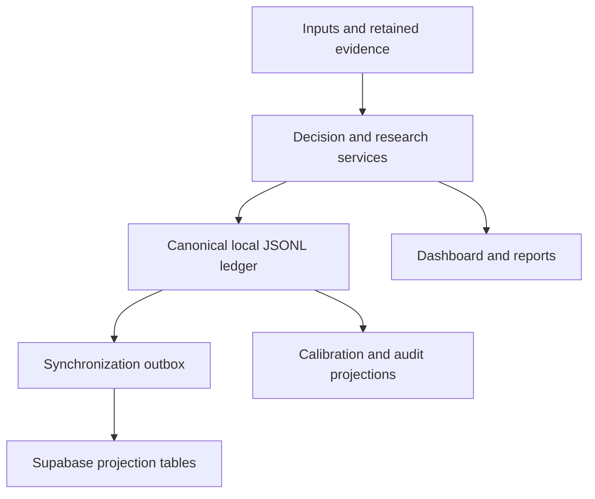
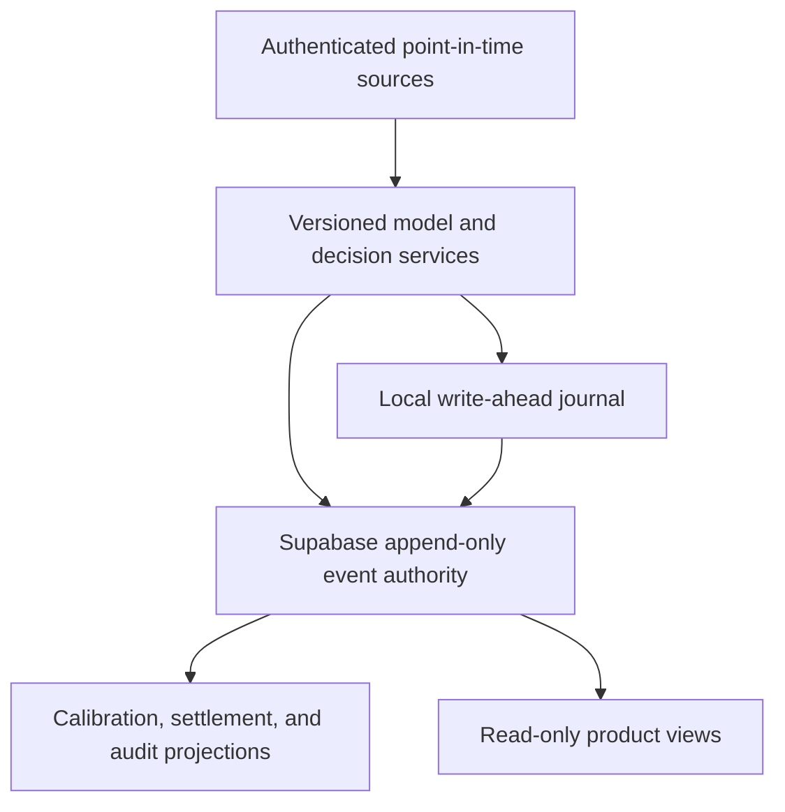

# Bear Edge architecture

**Status:** current and target architecture are intentionally separated

**Safety boundary:** `RESEARCH_ONLY`, authorized stake `$0`, execution disabled

SAFETY_INVARIANT: authorization is RESEARCH_ONLY; authorized stake is $0; execution is disabled.

## CURRENT: what the recovered system actually implements

The current decision lifecycle is local-authoritative:

- executable code, schemas, migrations, registry entries, and release identity are owned by an exact Git commit;
- the application appends canonical records to a local JSONL ledger;
- the local outbox contains projection machinery, but current v2.1 records cannot synchronize to the observed live v2.0-only tables;
- live Supabase table comments and `authority = 'local'` constraints confirm projection semantics;
- dashboards, reports, Drive documents, plugin output, and conversations are derived context, not operational authority.

Supabase is live but incomplete relative to Git. It currently has decision, settlement, and amendment projection tables constrained to audit schema v2.0. The recovered application emits v2.1 records, and the v2.1 compatibility migration is not deployed, so current new-record synchronization is incompatible and now fails closed unless verified v2.1 support is explicitly configured. Live Supabase also has no deployed shadow outcome/closing-price tables, quote-event table, model registry, promotion table, or edge function.

## TARGET: architecture after an explicit authority cutover

The target described by the August 1 master plan is:

- Git remains authority for code, contracts, migrations, model definitions, promotion policy, and release identity;
- Supabase becomes the durable append-only authority for operational quote, prediction, decision, outcome, closing-price, settlement, and amendment events;
- local JSONL becomes offline write-ahead and replay storage rather than final authority;
- raw evidence remains content-addressed and referenced by immutable digest;
- dashboards and spreadsheets remain derived views.

The target is not implemented merely because this document describes it.

## Cutover gate

Do not call Supabase the operational authority until all of these are directly verified on one exact release commit:

1. Reviewed append-only contracts exist for quotes, predictions, decisions, outcomes, closing prices, settlements, and amendments.
2. Migrations are deployed with row-level security, immutable write rules, stable identifiers, and content digests.
3. Local and remote records reconcile by count, identity, and digest.
4. Retry, idempotency, duplicate, conflict, and offline-replay behavior pass fault-injection tests.
5. A cutover timestamp and schema version are retained.
6. Application code, tests, database comments, and constraints agree on Supabase authority.
7. Rollback preserves every event and never rewrites history.

Until that gate passes, the exact language is:

> CURRENT: local JSONL is authoritative; Supabase is a remote projection.
>
> TARGET: Supabase is authoritative after explicit cutover; local JSONL is a write-ahead/replay journal.

## Component map

| Component | Current state | What it proves | What it does not prove |
|---|---|---|---|
| Core odds/EV/Kelly engine | implemented and tested | deterministic arithmetic and decision gates | model accuracy or profitable edge |
| Model registry | five `research_only` MLB entries | registered tuples and complete promotion constraints | full implementation identity for four entries, any training cutoff, calibration, or predictive validity |
| Negative-binomial pitcher-K lane | implemented research code | executable distribution/model mechanics | complete data, live lineup/price access, or validation |
| Calibration system | implemented and tested | metric/report and promotion-gate mechanics | existence of a qualifying cohort |
| Local audit ledger | implemented and tested | append-only record behavior and integrity checks | remote durability or truth of caller-entered evidence |
| Supabase projection | implemented in code; deployed schema incompatible with current v2.1 records | a remote Bear Edge-shaped v2.0 projection exists | successful current-record synchronization, authority cutover, or complete event schema |
| Dashboard/PWA | implemented and tested | local research/operator interface behavior | physical-device installation or production deployment |
| Source adapters | mixed | some official/public/manual research intake exists | licensed coverage, completeness, or live freshness |
| Esports model | absent | nothing | no game-specific probability generator exists |
| Esports evaluator draft | quarantined | deterministic scaffold concepts exist locally | authentic evidence, calibrated signal, projection compatibility, or safe stake semantics |

## Model and evidence boundary

A real prediction path must preserve this event order:

1. source payload captured;
2. feature snapshot constructed strictly from data available at the cutoff;
3. feature snapshot and implementation digests frozen;
4. model probability generated before price cutoff and event start;
5. exact market quote captured with independent provenance;
6. decision recorded regardless of `PASS`, `WAIT`, or research signal;
7. official outcome and exact closing quote captured later;
8. settlement and calibration computed without editing earlier records.

A digest demonstrates self-consistency only when it is compared with a separately retained trusted reference. A self-contained or caller-computed digest does not by itself prove unchanged bytes, authenticity, independent sourcing, licensing, timeliness, or correct interpretation. Those properties require an anchored receipt, authenticated adapters, retained access grants, source lineage, and point-in-time controls.

## Runtime prohibitions

- No model promotion from backtest results alone.
- No real-money execution while authorization is `PRICE_CHECK_ONLY`.
- No positive authoritative stake on a non-`BET` record.
- No replay record in a prospective calibration cohort.
- No caller-authored `verified` flag treated as source authentication.
- No provider names treated as independent when they share upstream data.
- No migration or document treated as deployed runtime proof without live verification.
